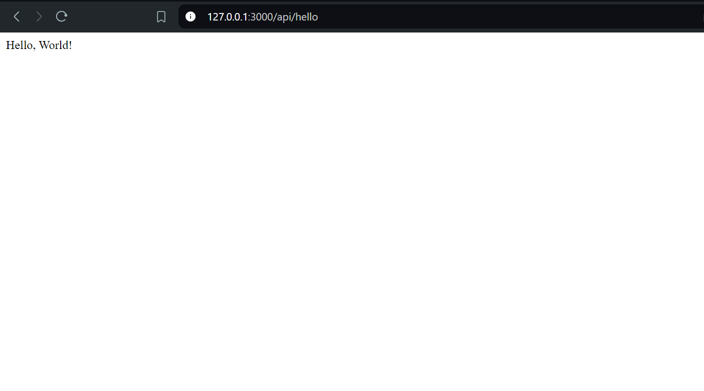

### Steps to run historical-data-api

Run this API  
```
node src/server.js
```

```
npm install express @azure/storage-blob @azure/identity
```

To run the API endpoints, follow these steps:

1. Install the required dependencies by running the following command:
    ```
    npm install
    ```

2. Start the server by running the following command:
    ```
    node src/server.js
    ```

3. Access the API endpoints using the appropriate HTTP methods and URLs.
```
http://127.0.0.1:3000/api/hello
```
